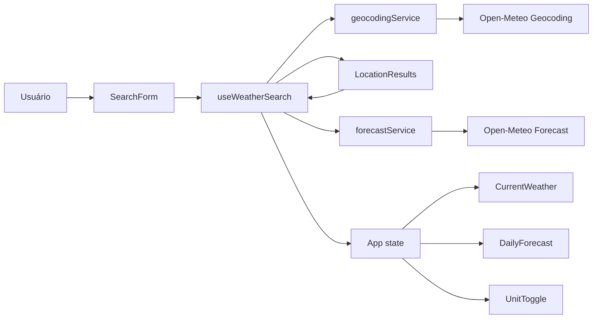

# Plano Técnico — Weather App

## 1. Architecture Overview

O app será uma SPA React client-side, sem autenticação, backend próprio ou segredo no cliente. A UI depende de hooks para orquestrar estado e de services para acessar a Open-Meteo. Os services convertem respostas externas em modelos internos normalizados; componentes não conhecem o formato bruto da API.



Responsabilidades:

- `App`: compõe a tela, mantém a unidade selecionada e conecta os estados de busca à UI.
- `SearchForm`: controla somente o texto de entrada, valida antes de enviar e expõe a mensagem de termo inválido.
- `useWeatherSearch`: administra transições de estado, cancelamento de requisições e retry da última intenção do usuário.
- `services`: fazem `fetch`, validam status HTTP e normalizam respostas da Open-Meteo.
- Componentes de apresentação: renderizam dados normalizados, valores neutros e estados de loading, erro e vazio.

## 2. Tech Stack

| Tecnologia | Uso | Justificativa |
| --- | --- | --- |
| TypeScript 6 em modo `strict` | Código e contratos | As configurações já recusam tipos implícitos e código não utilizado. |
| React 19 + React DOM | Componentes e estado local | Dependências já instaladas; o escopo não requer store global. |
| Vite 8 | Desenvolvimento e build | Configurado no projeto, com build estático adequado ao deploy. |
| Tailwind CSS 3 | Estilo responsivo | Segue o tema dark glassmorphism existente e reduz CSS específico. |
| Open-Meteo | Geocoding e previsão | Pública, sem API key, conforme NFR5. |
| lucide-react | Iconografia funcional | Ícones consistentes, acessíveis e adequados para ações, métricas e contexto meteorológico sem SVG manual. |
| Vitest + Testing Library | Testes unitários e de componentes | Ambiente `jsdom` e setup já configurados. |
| Playwright | Fluxos E2E desktop e mobile | Projetos Chromium e iPhone 13 já definidos. |
| Biome | Lint e formatação | Comandos do repositório aplicam qualidade a `src` e `tests`. |

## 3. Project Structure

```text
src/
  components/
    icons.ts                  # mapeamento semântico entre contexto climático/métrica e ícones lucide
    SearchForm.tsx            # entrada, validação e submissão
    LocationResults.tsx       # resultados selecionáveis com contexto regional
    CurrentWeather.tsx        # métricas atuais
    DailyForecast.tsx         # grade dos cinco dias
    ForecastDay.tsx           # uma entrada diária
    UnitToggle.tsx            # controle C/F acessível
    FeedbackState.tsx         # loading, vazio e erro com retry
  hooks/
    useWeatherSearch.ts       # fluxo geocoding -> previsão e retry
  services/
    geocodingService.ts       # contrato do endpoint de localidades
    forecastService.ts        # contrato do endpoint meteorológico
    weatherCode.ts            # mapeamento puro de códigos para rótulo/ícone
  types/
    weather.ts                # tipos internos e tipos de estado
  utils/
    temperature.ts            # conversão e formatação puras
    date.ts                   # formatação pt-BR de datas
  App.tsx
  main.tsx
  index.css                   # diretivas Tailwind e estilos globais mínimos
tests/
  unit/                       # services, utils, hook e componentes
  e2e/                        # jornadas com respostas HTTP interceptadas
```

Cada componente React terá um único arquivo e exportação padrão. Serviços não renderizam nem alteram estado React; utilitários e mapas de ícones não executam I/O.

## 4. Data Model

Os dados canônicos ficam em Celsius, a unidade padrão (BR4). Campos ausentes são opcionais ou `null`; a apresentação os transforma em `—` (BR6).

```ts
type TemperatureUnit = 'celsius' | 'fahrenheit';

interface Location {
  id: number;
  name: string;
  country: string | null;
  admin1: string | null;
  latitude: number;
  longitude: number;
  timezone: string | null;
}

interface CurrentWeather {
  temperatureCelsius: number | null;
  apparentTemperatureCelsius: number | null;
  weatherCode: number | null;
  relativeHumidity: number | null;
  windSpeedKmh: number | null;
  precipitationMm: number | null;
}

interface ForecastDay {
  date: string;
  weatherCode: number | null;
  minimumTemperatureCelsius: number | null;
  maximumTemperatureCelsius: number | null;
  precipitationMm: number | null;
  maximumWindSpeedKmh: number | null;
}

interface WeatherData {
  current: CurrentWeather;
  daily: ForecastDay[];
}

type SearchStatus = 'idle' | 'searchingLocations' | 'selectingLocation' |
  'loadingForecast' | 'success' | 'empty' | 'error';

type WeatherVisualTone = 'clear' | 'cloudy' | 'rain' | 'storm' | 'fog' | 'snow' | 'wind' | 'neutral';

interface WeatherVisualDescriptor {
  label: string;
  altText: string;
  icon: string;
  tone: WeatherVisualTone;
}
```

`Location.id`, quando disponível, é a chave estável da lista. O contexto exibido deriva de `admin1` e `country`, omitindo apenas partes indisponíveis sem ocultar o nome principal da cidade (RF8).

`WeatherVisualDescriptor` estende o mapeamento WMO existente para separar significado, acessibilidade e apresentação. O campo `icon` referencia uma chave semântica de `components/icons.ts`; componentes recebem descrição e tom visual, mas não decidem qual ícone representa cada condição.

## 5. Data Flow

1. `SearchForm` faz `trim` do termo no submit. Menos de dois caracteres não chama o service e mostra a orientação local (RF1, RF9, BR1).
2. `useWeatherSearch` define `searchingLocations`, chama o geocoding e substitui a lista anterior pelo resultado atual.
3. Sem resultados, o hook limpa cidade e previsão selecionadas e define `empty` (AC1, BR7). Com resultados, define `selectingLocation` e exibe todas as opções.
4. O clique ou acionamento por teclado em uma opção define a cidade selecionada e inicia uma consulta de forecast em `loadingForecast` (RF2, RF3).
5. `forecastService` normaliza `current` e arrays `daily`, limita a lista aos cinco primeiros itens e o hook publica `success` somente com uma resposta válida.
6. `App` passa os valores canônicos e `TemperatureUnit` aos componentes. A troca de unidade recalcula somente valores de renderização, sem fetch (RF6, BR5).
7. Uma nova busca aborta a requisição anterior com `AbortController`; respostas abortadas ou obsoletas não alteram o estado atual.

Decisão de UX: a busca ocorre somente por submit explícito (Enter ou botão). Resultados são exibidos na ordem retornada pela Open-Meteo, limitados a dez opções; não há seleção automática, mesmo com uma correspondência. Isso mantém a confirmação explícita exigida por BR2 e evita homônimos inesperados.

## 6. External APIs

### Geocoding

`GET https://geocoding-api.open-meteo.com/v1/search`

Parâmetros: `name={encodeURIComponent(query)}`, `count=10`, `language=pt` e `format=json`. O service aceita a ausência de `results` como lista vazia e extrai `id`, `name`, `country`, `admin1`, `latitude`, `longitude` e `timezone`.

### Forecast

`GET https://api.open-meteo.com/v1/forecast`

Parâmetros:

```text
latitude={latitude}&longitude={longitude}&timezone=auto&forecast_days=5
&current=temperature_2m,apparent_temperature,weather_code,relative_humidity_2m,wind_speed_10m,precipitation
&daily=weather_code,temperature_2m_min,temperature_2m_max,precipitation_sum,wind_speed_10m_max
```

Não enviar `temperature_unit=fahrenheit`: a API sempre retorna Celsius, preservando o modelo canônico e garantindo a conversão local imediata. `weather_code` será mapeado pela tabela WMO da Open-Meteo para rótulos pt-BR e ícones com texto alternativo.

Para ambos endpoints, `response.ok === false`, falha de rede, JSON inválido e estrutura sem coordenadas ou dados meteorológicos necessários se tornam erros tipados do service.

## 7. State Management

Estado local em `App` e `useWeatherSearch`, sem Context ou biblioteca externa:

| Estado | Dono | Valor inicial | Transições relevantes |
| --- | --- | --- | --- |
| `unit` | `App` | `celsius` | Alternância C/F; não dispara fetch. |
| `query` | `SearchForm` | `''` | Controlado durante digitação. |
| `locations` | `useWeatherSearch` | `[]` | Preenchido pelo geocoding; limpo em nova busca. |
| `selectedLocation` | `useWeatherSearch` | `null` | Definido por seleção; limpo em busca vazia/sem resultado. |
| `weather` | `useWeatherSearch` | `null` | Definido após forecast; limpo antes de nova busca. |
| `status` e `error` | `useWeatherSearch` | `idle` e `null` | Fonte de verdade para feedback. |
| `retryAction` | `useWeatherSearch` | `null` | Registra busca ou cidade que falhou. |

Ao iniciar nova busca, limpar previsão e cidade anterior evita vazamento de contexto (BR7). A unidade permanece na sessão, inclusive ao trocar de cidade, mas não é persistida entre recargas (fora de escopo).

## 8. Error Handling Strategy

| Cenário | Estado/UI | Ação |
| --- | --- | --- |
| Inicial | `idle`, orientação de busca | Sem requisição. |
| Termo vazio ou com menos de dois caracteres | Mensagem associada ao campo | Bloquear submit e preservar estado consistente. |
| Geocoding em curso | `searchingLocations` | Indicador acessível no formulário. |
| Sem localidades | `empty` | Mensagem específica; cidade e previsão permanecem limpas. |
| Escolha de local | `selectingLocation` | Lista de botões com nome e contexto. |
| Forecast em curso | `loadingForecast` | Indicador visual e anúncio por `aria-live` em modo polite. |
| HTTP, rede, JSON inválido ou payload inválido | `error` | Texto compreensível, botão “Tentar novamente” e anúncio em modo assertive. |
| Campo individual ausente | `success` | Exibir `—`; os demais campos continuam disponíveis. |

O retry repete a última operação falha: geocoding com o termo submetido ou forecast com a `Location` selecionada. Erros de aborto não são exibidos. Mensagens dinâmicas usam live regions com prioridade adequada: `aria-live="polite"` para progresso e `role="alert"`/`aria-live="assertive"` para erros críticos. O foco continua no controle iniciado pelo usuário, exceto quando for necessário focar uma mensagem de erro acionável.

## 9. UI and Accessibility Decisions

- Aplicar layout mobile-first em Tailwind, com fundo `night-900`, superfícies glass (`bg-white/5`, `backdrop-blur-md`, bordas sutis) e contraste de texto claro.
- Modernizar a apresentação com uma linguagem atmosférica suave: fundo em camadas discretas inspirado em céu noturno, superfícies translúcidas menos densas, bordas de baixa opacidade, sombras difusas e gradações contextuais por condição climática sem comprometer contraste.
- Criar uma hierarquia mais sofisticada: cabeçalho compacto, busca como ação primária, cartão de clima atual como destaque editorial-operacional e previsão em cartões de leitura rápida. Em mobile, priorizar temperatura, condição e ação de busca antes de métricas secundárias.
- Substituir rótulos isolados de condição por pares ícone + texto. O ícone comunica varredura visual; o texto permanece como fonte semântica para acessibilidade e precisão.
- Usar iconografia funcional com `lucide-react`: `Search`, `MapPin`, `Navigation`, `Thermometer`, `Droplets`, `Wind`, `CloudRain`, `Sun`, `Cloud`, `CloudFog`, `CloudSnow`, `CloudLightning`, `RefreshCcw`, `AlertCircle`, `LoaderCircle` e `Gauge` quando aplicável.
- Definir tamanhos estáveis de ícones: 20-24px para controles e métricas, 32-40px para condição atual, 24-28px para previsão diária. Ícones decorativos devem ter `aria-hidden="true"`; ícones que representam condição usam texto adjacente ou `aria-label` via rótulo existente.
- Aplicar microinterações suaves e contidas: entrada dos painéis com opacidade/translação curta, transição de unidade sem deslocamento de layout, feedback hover/focus perceptível e spinner discreto em loading. Respeitar `prefers-reduced-motion` removendo translação e rotação contínua.
- Evoluir a paleta sem cair em tema monocromático: manter base escura, acrescentar acentos de ciano para vento/chuva, âmbar para sol/temperatura e verde-água para estados neutros. Erros usam vermelho suave com alto contraste, sem depender só de cor.
- Usar `main`, `header`, `form`, `section`, `article`, listas e botões reais. Resultados de localização são botões navegáveis por Tab, Enter e Espaço.
- O input tem `label` visível ou acessível, `aria-describedby` para validação e submit por Enter. O alternador de unidade é um grupo rotulado de botões com estado atual em `aria-pressed`.
- A área de feedback de status usará `role="status"` e `aria-live="polite"` para carregamento e progresso, enquanto mensagens críticas usarão `role="alert"` e `aria-live="assertive"` sem conflito de anúncios.
- Controles de escolha devem expor estado ativo/selecionado por meio de `aria-pressed`, `aria-current` ou equivalente, com destaque visual consistente para cada opção selecionada.
- Exibir previsão em `grid grid-cols-2 sm:grid-cols-3 lg:grid-cols-5`, com cinco cartões de tamanho estável e foco visível.
- Formatar datas por `Intl.DateTimeFormat('pt-BR', ...)`. Exibir ícone e rótulo textual da condição, sem depender apenas de cor ou símbolo.

### 9.1 UX Modernization Plan

Objetivo: elevar a percepção de qualidade sem reduzir a rapidez de consulta do MVP. A modernização deve atender US1, US4, RF4, RF5, RF7, RF8, NFR2 e NFR3.

1. Direção visual
   - Manter dark glassmorphism, mas reduzir aparência genérica com profundidade por camadas: background atmosférico, painel principal, cartões de métrica e estados.
   - Usar raios de 8px ou menos nos cartões, alinhado à regra visual do projeto, com espaçamentos consistentes e leitura densa o suficiente para uso recorrente.
   - Reservar tipografia grande apenas para temperatura atual; demais títulos ficam compactos para favorecer escaneabilidade.

2. Sistema de iconografia
   - Centralizar ícones em `components/icons.ts`, expondo mapas semânticos por condição e métrica.
   - Condições WMO: céu limpo -> `Sun`; parcialmente nublado -> `CloudSun`; nublado -> `Cloud`; neblina -> `CloudFog`; garoa/chuva -> `CloudRain`; neve -> `CloudSnow`; tempestade -> `CloudLightning`; vento forte ou condição neutra -> `Wind`/`Cloud`.
   - Métricas: temperatura -> `Thermometer`; sensação térmica -> `Gauge`; umidade -> `Droplets`; vento -> `Wind`; precipitação -> `CloudRain`; localidade -> `MapPin`; retry -> `RefreshCcw`; erro -> `AlertCircle`; busca -> `Search`.
   - Evitar ícones puramente ornamentais. Todo ícone deve reforçar uma métrica, uma ação ou uma condição climática.

3. Componentes prioritários
   - `SearchForm`: botão com ícone de busca, estado loading com `LoaderCircle`, foco visível e mensagem de validação visualmente próxima ao campo.
   - `LocationResults`: cada localidade com `MapPin`, país/região em hierarquia secundária e estado selecionado claro durante `loadingForecast`.
   - `CurrentWeather`: cartão principal com temperatura dominante, ícone climático grande, condição textual, sensação térmica e três métricas com ícones.
   - `ForecastDay`: cartões compactos com data, ícone da condição, máxima/mínima e indicadores de chuva/vento com alinhamento estável.
   - `FeedbackState`: estados vazio, erro e loading com ícone próprio, tom visual distinto e ação de retry evidente.

4. Suavidade e movimento
   - Adicionar transições de 150-220ms para hover, focus, troca de unidade e entrada de resultados.
   - Evitar animações decorativas longas; loading usa rotação somente quando `prefers-reduced-motion` permitir.
   - Garantir que animações não alterem dimensões dos cartões nem reposicionem texto durante atualizações.

5. Critérios de aceite UX
   - Em desktop e mobile, a primeira dobra deve comunicar cidade, temperatura, condição e ação principal sem sobreposição.
   - Toda métrica meteorológica relevante deve ter ícone contextual e rótulo textual.
   - Estados de loading, erro, vazio e seleção devem ser distinguíveis por texto, ícone e hierarquia visual.
   - A paleta deve preservar contraste AA para textos essenciais e foco visível em todos os controles.
   - A troca C/F deve atualizar valores sem requisição, sem salto de layout e mantendo largura estável para temperaturas.

## 10. Testing Strategy

### Unitários e componentes (Vitest + Testing Library)

- `temperature`: conversão C/F, arredondamento de exibição, valores nulos e ausência de nova chamada ao service após trocar a unidade (AC4, NFR6).
- `geocodingService` e `forecastService`: URL e parâmetros, normalização, arrays de cinco dias, HTTP não-OK, rede, JSON/payload inválido e campos ausentes (AC1-AC3).
- `useWeatherSearch`: mínimo de dois caracteres, limpeza de dados anteriores, estados, seleção explícita, retry e proteção contra resposta obsoleta (AC1, AC5).
- Componentes: contexto de homônimos, métricas atuais, fallback `—`, cinco previsões, loading, vazio, erro, rótulos e acionamento por teclado (AC1-AC6, NFR3).

Mockar `fetch` nos testes de services/hook; não depender da Open-Meteo em testes automatizados. Criar fixtures completas, vazias, incompletas e com erro.

### E2E (Playwright)

- Busca válida -> resultados -> seleção -> clima atual e exatamente cinco dias.
- Cidade homônima -> escolha com região e país preservados no cabeçalho.
- Busca inexistente -> estado vazio, sem dados da busca anterior.
- Falha do geocoding e do forecast -> mensagem e retry recuperando o fluxo.
- Alternância C/F -> todas as temperaturas mudam sem nova requisição interceptada.
- Submissão vazia/curta -> mensagem de validação e nenhuma requisição.
- Executar os fluxos nos projetos `chromium` e `mobile`; validar teclado no fluxo de busca e seleção.

## 11. Implementation Sequence

1. Criar tipos internos, fixtures e utilitários puros de temperatura, data e códigos WMO; cobrir conversão e fallbacks unitariamente.
2. Implementar `geocodingService` e `forecastService` com normalização, erros tipados e testes com respostas mockadas.
3. Implementar `useWeatherSearch` com máquina de estados simples, cancelamento e retry; validar transições em teste.
4. Construir `SearchForm` e `LocationResults`, incluindo validação, seleção explícita e acessibilidade de teclado.
5. Construir `CurrentWeather`, `ForecastDay`, `DailyForecast` e `UnitToggle`; integrar em `App` com layout Tailwind responsivo.
6. Modernizar a camada visual: instalar `lucide-react`, criar `components/icons.ts`, aplicar iconografia contextual e refinar cartões, hierarquia, tokens de cor e microinterações.
7. Adicionar feedback para todos os estados e executar testes E2E com rotas da API interceptadas.
8. Implementar a camada de a11y específica do ajuste: live regions consistentes, estado selecionado em controles e validação de foco/teclado.
9. Executar `pnpm lint`, `pnpm build`, `pnpm test` e `pnpm test:e2e` antes da revisão.

## 12. Accessibility Implementation Plan

O ajuste de acessibilidade incorporado à spec exige uma implementação explícita e verificável. A execução deve seguir esta sequência:

1. Review de live regions
   - Definir um padrão único: `status` + `aria-live="polite"` para progresso e `alert` + `aria-live="assertive"` para erro crítico.
   - Garantir que não haja duplicidade de anúncio por conflito entre `role` e `aria-live`.
   - Validar mensagens de carregamento, vazio e retry sem ruído excessivo.

2. Estado semântico para elementos selecionáveis
   - Em `LocationResults`, marcar a opção ativa com `aria-pressed` ou `aria-current`, além do destaque visual.
   - Em `UnitToggle`, preservar a semântica do grupo e do item selecionado, sem depender apenas de cor.
   - Garantir que o estado selecionado seja anunciado corretamente por leitores de tela.

3. A11y de teclado e foco
   - Manter foco no controle que originou a ação, exceto em casos em que a mensagem de erro requer foco explícito.
   - Confirmar que a navegação por Tab, Enter e Espaço continua funcional em todos os componentes interativos.
   - Revalidar o foco visível em botões, opções e ação de retry.

4. Testes de regressão e verificação
   - Criar testes unitários para garantir que os estados de erro/carregamento e seleção ativa exponham semântica correta.
   - Adicionar cenário E2E para verificar anúncio e comportamento de teclado em busca, seleção e retry.
   - Usar ferramentas de auditoria e testes de acessibilidade para confirmar ausência de alertas críticos.

## 13. Risks & Trade-offs

| Risco ou decisão | Impacto | Mitigação ou justificativa |
| --- | --- | --- |
| Homônimos e resultados similares | Consulta da cidade errada | Sempre solicitar seleção explícita e exibir região/país. |
| Requisições concorrentes | Dados antigos sobrescrevem a tela | Abortar a anterior e ignorar respostas obsoletas. |
| Resposta Open-Meteo incompleta | Falha visual ou lógica | Normalizar campos como nulos e renderizar fallback por métrica. |
| Ausência de cache/persistência | Mais consultas entre sessões | Fora de escopo; reduz complexidade e risco de dados defasados. |
| Estado local em vez de store global | Escala limitada | Suficiente para uma tela e uma cidade; migrar apenas se surgirem fluxos compartilhados. |
| Conversão local, não na API | Arredondamentos consistentes | Centralizar cálculo e arredondar apenas na exibição; atende BR5 e NFR1. |
| Dependência de API pública | Indisponibilidade eventual | Mensagem clara, retry e testes com mocks; não há fallback de dados no MVP. |
| Iconografia excessiva ou ambígua | Poluição visual e menor acessibilidade | Usar apenas ícones com função clara, sempre acompanhados de texto ou rótulo acessível. |
| Modernização visual reduzindo contraste | Risco em NFR3 e leitura mobile | Validar contraste, foco e `prefers-reduced-motion`; não depender de transparência ou cor isolada. |